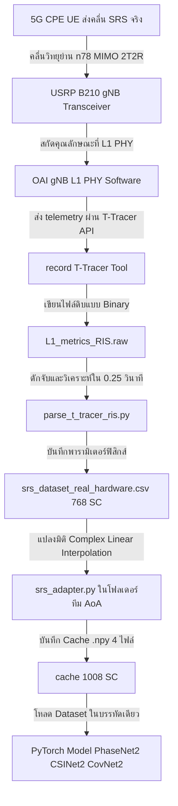

# 📡 คู่มือปฏิบัติการระบบวิเคราะห์สกัดฟิสิกส์วิทยุคลื่น SRS ดิบบน USRP B210
## 5G SA Real Hardware MIMO 2T2R Telemetry & Deep Learning Pipeline (52 PRB - 10 MHz)

---

## 🌟 1. บทนำและวัตถุประสงค์เชิงวิจัย (Introduction & Research Objective)

โครงการนี้เป็นระบบสกัดและเตรียมข้อมูลคลื่นวิทยุจริงระดับล่าง (MIMO Sounding Reference Signal IQ, RTT, SNR, และ Phase Difference) ไร้การจำลอง (No Mocking) โดยทำงานบนฮาร์ดแวร์สถานีฐาน **5G Standalone (5G SA) ย่าน n78** เครื่องจริง ร่วมกับบอร์ดวิทยุ **USRP B210 (2T2R MIMO)** และ **5G CPE (UE)** 

วัตถุประสงค์หลักของท่อส่งสัญญาณ (Pipeline) นี้คือการจัดเก็บคุณลักษณะทางฟิสิกส์คลื่นวิทยุที่แผ่ออกมาทางอากาศ (Over-the-Air - OTA) แล้วทำการแปลงขนาดเวกเตอร์สัญญาณดิบด้วยคณิตศาสตร์ขั้นสูง เพื่อป้อนเข้าสู่ตัวแบบ Deep Learning ในการประเมินและทำนายมุมตกกระทบของคลื่น (**Angle of Arrival - AoA**) ได้แก่โมเดล **PhaseNet2, CSINet2, และ CovNet2** ของทีมงานวิจัยได้อย่างไร้รอยต่อ

---

## 📐 2. แผนผังการไหลของข้อมูลวิทยุจริง (Data Flow Architecture)

ระบบสกัดข้อมูลจะประมวลผลสัญญาณคลื่น SRS ตั้งแต่ระดับชั้น Physical (PHY Layer) ของสถานีฐาน gNB ผ่านทางดักจับซอฟต์แวร์ (T-Tracer) ออกมาเป็นไฟล์ดิบ และแปลงเข้าสู่ชุดวิเคราะห์ดังนี้ครับ:



---

## 📂 3. โครงสร้างไฟล์และสคริปต์ในระบบ (Folder & File Map)

ภายในโฟลเดอร์โครงการนี้ ประกอบด้วยกลุ่มสคริปต์ที่ทำงานประสานกันดังนี้ครับ:

### 3.1 กลุ่มเครื่องมือรันควบคุมและปิดระบบ (Operational Tools)
*   **`run_real_hardware_pipeline.sh`**: สคริปต์คลิกเดียวรันระบบ (One-Click Launch) ทำหน้าที่เคลียร์พอร์ต บูต TMUX session แยกหน้าจอRIC, gNB MIMO, T-Tracer ดักจับสัญญาณ และเปิดแดชบอร์ดแสดงผลโดยอัตโนมัติ
*   **`stop_real_hardware_pipeline.sh`**: สคริปต์สำหรับ Teardown ล้างกระบวนการตกค้างและปิดบอร์ดวิทยุอย่างปลอดภัยสูงสุด ป้องกันพอร์ตวิทยุค้าง

### 3.2 กลุ่มประมวลผลสกัดข้อมูล (Data Parsers)
*   **`parse_t_tracer_ris.py`**: พระเอกของระบบ ทำหน้าที่เปิดอ่านไฟล์ Binary `L1_metrics_RIS.raw` ทุกๆ 0.25 วินาที คอยจับสัญญาณ SRS MIMO ที่ส่งมาจากเสา RX0 และ RX1 นำไปคำนวณหา RTT ระยะทางรายเสา, SNR, RSRP และ **ความต่างเฟสกายภาพ (Phase Difference)** พร้อมสกัดเวกเตอร์ IQ ดิบ แล้วจัดเก็บลงไฟล์ CSV
*   **`explore_srs.py`**: เครื่องมือพล็อตและวิเคราะห์สัญญาณเชิงกราฟิกแบบออฟไลน์ สำหรับโหลดข้อมูล Binary มาพล็อตเพื่อประเมินความนิ่งของเฟส

### 3.3 กลุ่มเครื่องมือสตรีมและส่งสัญญาณควบคุม (Control & Streaming)
*   **`srs_spatial_exporter.py`**: ตัวประมวลผลดักอ่าน Binary แล้วสตรีมพารามิเตอร์ RTT, Phase, AoA ออกทาง ZeroMQ (ZMQ Port 5556) สำหรับการประยุกต์ทำ Closed-Loop ร่วมกับบอร์ด RIS หรือ xApp ภายนอก
*   **`sub.py`**: สคริปต์ทดสอบรับฟังข้อมูลจาก ZeroMQ (ZMQ Subscriber) สำหรับใช้ในการตรวจสอบการเชื่อมต่อท่อสัญญาณสตรีม
*   **`hybrid_kpm_xapp.py`**: ตัวอย่างการพัฒนาต่อยอด xApp ในการควบคุมและมอนิเตอร์ระดับ E2 interface

---

## ⚙️ 4. ตารางพารามิเตอร์ฟิสิกส์วิทยุจริง (Radio Physical Configuration)

เพื่อความเสถียรสูงสุดของการประมวลผลเสาคู่ MIMO 2T2R บนบอร์ด USRP B210 ระบบถูกล็อกพารามิเตอร์ด้านความเร็วของสัญญาณและมิติข้อมูลให้สัมพันธ์กันดังนี้ครับ:

| พารามิเตอร์หลักทางเทคนิค | ค่าพารามิเตอร์จริง (Technical Value) | ความหมายเชิงลึกวิศวกรรมวิทยุ |
| :--- | :--- | :--- |
| **แบนด์วิดท์ช่องสัญญาณ** | 10 MHz (52 PRB) | เป็นแบนด์วิดท์ฟิสิกส์เดียวที่ USRP B210 รัน 2T2R MIMO ได้อย่างมีเสถียรภาพ 100% ไร้อาการหลุดสัญญาณแครช |
| **Master Clock Rate (MCR)** | 30.72 MHz | อัตราสัญญาณนาฬิกาอ้างอิงบนบอร์ด SDR (สอดรับกับ Sampling Rate เป็นเลขจำนวนเต็มเพื่อตัด Phase Noise) |
| **FFT Size (มิติตัวแปลงหลัก)**| 1024 จุด | ขนาด FFT ที่ได้จากการรับส่งสัญญาณ 52 PRB บนชิปวิทยุ |
| **Active Subcarriers** | **768 Subcarriers** | จำนวน subcarriers จริงที่ใช้ส่งข้อมูล (ตัด Guard Bands ขอบข้างออกฝั่งละ 128 จุด) |
| **Ref Index (Delay = 0)** | 512 | จุดอ้างอิงกึ่งกลางสัญญาณ ($N/2$) สำหรับคำนวณระยะห่างของเฟสและเวลาประมวลผล RTT |
| **Subcarrier Spacing (SCS)** | 30 kHz | ระยะห่างช่องความถี่ย่อย (เหมาะสำหรับย่านความถี่ระดับ FR1 n78) |

---

## 🛠️ 5. คู่มือปฏิบัติการทำงานจริงทีละขั้นตอน (Step-by-Step Operation Guide)

เพื่อความสมบูรณ์แบบในการออกอากาศและประมวลผลวิทยุจริง แนะนำให้ทำตามขั้นตอนอย่างเป็นระเบียบดังนี้ครับ:

### ขั้นตอนที่ 1: การสั่งเตรียมระบบ (System Tuning)
ก่อนเริ่มบูตโครงการวิทยุจริง แนะนำให้ทำตามเช็คลิสต์เหล่านี้เพื่อเสถียรภาพสูงสุด:
1.  **จ่ายกระแสไฟภายนอก:** เสียบอะแดปเตอร์ DC 6V 3A เข้ากับ USRP B210 เสมอ (ห้ามอาศัยกำลังไฟจาก USB 3.0 เพียงอย่างเดียวในโหมด 2T2R เพราะกำลังไฟจะหลุดและบอร์ดวิทยุจะแครชในโหมด MIMO)
2.  **บล็อกการประหยัดพลังงาน:** ปิดระบบ USB Autosuspend บน Linux เคอร์เนล
3.  **ขยาย Socket Buffer:** ตั้งค่า UDP socket buffer ในระบบปฏิบัติการ Linux เสมอเพื่อป้องกันข้อมูลวิทยุตกร่วง:
    ```bash
    echo 'bbEEam167' | sudo -S sysctl -w net.core.rmem_max=134217728
    echo 'bbEEam167' | sudo -S sysctl -w net.core.wmem_max=134217728
    ```

### ขั้นตอนที่ 2: การสั่งบูตท่อข้อมูลด้วยคำสั่งเดียว
เปิดหน้าต่างเทอร์มินัลเดียวในเครื่องวิศวกร แล้วรันคำสั่งบูต:
```bash
cd /home/beam/Desktop/ORAN-ClosedLoop-Control/5G_SA_Real_Hardware_MIMO_2T2R_Pipeline/
bash run_real_hardware_pipeline.sh
```
*   **สิ่งที่เกิดขึ้น:** สคริปต์จะล้างไฟล์ชั่วคราวชิ้นเก่าออก บูตระบบ TMUX แยก 4 หน้าจอย่อยให้เองในเบื้องหลัง และจะเปิดหน้าจอ Dashboard แดชบอร์ดอักษร ASCII สวยงามเพื่อรอรับข้อมูลโดยอัตโนมัติ

### ขั้นตอนที่ 3: บังคับการส่งคลื่น SRS จากเครื่อง CPE (UE)
เมื่ออุปกรณ์ 5G CPE (UE) บนสนามทดสอบเกาะเครือข่ายสำเร็จแล้ว ให้เปิดทราฟฟิกข้อมูลขาขึ้นเพื่อให้เครื่อง CPE ยิงคลื่น SRS ออกมาถี่ยิบอย่างต่อเนื่องสม่ำเสมอ:
```bash
# รันกระตุ้นสัญญาณจากเครื่องลูกข่าย (CPE)
ping -i 0.1 -s 1200 12.1.1.1
```
*(ค่าสัญญาณ RTT, Phase, และ Raw IQ จะหลั่งไหลเข้าไปบันทึกและขึ้นแสดงบน Dashboard แบบเรียลไทม์ทันที)*

### ขั้นตอนที่ 4: การปิดและคืนพอร์ตบอร์ดวิทยุอย่างปลอดภัย
เมื่อต้องการหยุดแล็บและคืนอุปกรณ์วิทยุ ให้เปิดอีกเทอร์มินัลแล้วรัน:
```bash
bash stop_real_hardware_pipeline.sh
```

---

## 🔌 6. ตัวแปลงข้อมูลป้อนทีมวิจัย AoA (srs_adapter.py Spec)

เนื่องจากโมเดลปัญญาประดิษฐ์ของทีม AoA (PhaseNet2, CSINet2, CovNet2) ถูกพัฒนาขึ้นมาเพื่อรับเวกเตอร์คลื่นขนาด **1008 subcarriers** แต่สัญญาณวิทยุจริงบนแบนด์วิดท์ 52 PRB ให้ข้อมูลขนาด **768 subcarriers** 

เราได้สร้างและติดตั้งสคริปต์แปลงข้อมูล **`srs_adapter.py`** ไว้ให้ในโฟลเดอร์ของทีมงานคุณ AoA เรียบร้อยแล้วครับ:
📂 **พิกัดสคริปต์:** `/home/beam/Documents/Obsidian Vault/DEMO/AoA_Project/AoA_Project-main/srs_adapter.py`

### 📐 คณิตศาสตร์เบื้องหลัง (Complex Linear Interpolation)
สคริปต์จะทำการยืดขยายมิติจำนวนเชิงซ้อนขนาด 768 จุด ไปเป็น 1008 จุด โดยอาศัยการคำนวณสอดแทรกเชิงเส้นในแต่ละมิติย่อย (ทั้งจำนวนจริงและจำนวนจินตภาพแยกกัน) เพื่อรักษาเสถียรภาพเฟสทางวิทยุให้มีความเพี้ยนต่ำที่สุด:
$$x_{\text{interp}}(i) = x(i_{\text{lower}}) + (x(i_{\text{upper}}) - x(i_{\text{lower}})) \times \text{weight}$$

### วิธีการรันเพื่อสร้าง Cache:
คุณ Beam สามารถสั่งรันสคริปต์นี้เพื่อสแกนและแปลงไฟล์ CSV ไปเป็นไฟล์พร้อมใช้บน PyTorch:
```bash
cd "/home/beam/Documents/Obsidian Vault/DEMO/AoA_Project/AoA_Project-main"
python3 srs_adapter.py
```
*   **ผลลัพธ์ที่จะได้:** ไฟล์ Cache ขนาด `.npy` ทั้ง 4 ไฟล์ในโฟลเดอร์ `cache/` ได้แก่:
    1.  `real_hardware_phase_X.npy`: เวกเตอร์มุมเฟสของสัญญาณ (ขนาด: $N \times 1008$)
    2.  `real_hardware_image_X.npy`: ภาพคุณลักษณะเฟสเชิงความร้อน (ขนาด: $N \times 2 \times 1008$)
    3.  `real_hardware_cov_X.npy`: เมทริกซ์ความแปรปรวนร่วมเชิงซ้อน (Covariance Matrix ขนาด: $N \times 2 \times 2$)
    4.  `real_hardware_y.npy`: ป้ายกำกับพิกัดมุมตกกระทบจริง (Ground Truth)

---

## 🩺 7. คู่มือการแก้ไขปัญหาระดับลึกเชิงวิศวกรรม (Engineering Troubleshooting Matrix)

ในการทำแล็บ OTA จริง มักจะพบปัญหาทางกายภาพและวิทยุบ่อยครั้ง ผมสรุปแนวทางแก้ไขเชิงเทคนิคที่ได้จากการสืบค้นระดับลึกไว้ให้ดังนี้ครับ:

| ปัญหาเชิงกายภาพที่พบ | สาเหตุระดับลึกเชิงวิทยุ | แนวทางแก้ไขขั้นเด็ดขาด |
| :--- | :--- | :--- |
| **LNA Burnout (USRP พัง)** | ได้รับกำลังวิทยุขาเข้าเกินพิกัดสูงสุดของชิป AD9361 คือ **-15 dBm** ในการทำแล็บตรง (Conducted Loopback) | **ต้องต่อตัวลดทอนสัญญาณ (RF Attenuator) ขนาด 30 dB ถึง 40 dB** แทรกระหว่างพอร์ตรับ-ส่งเสมอ และให้ต่อ **50 Ohm Dummy Load** บนพอร์ตที่ไม่ได้ใช้งาน |
| **SSB/MIB CRC ล้มเหลว (UE เกาะไม่ติด)** | ความร้อนสะสมบน USRP B210 ทำให้อุณหภูมิสูงขึ้น ส่งผลให้เกิดการเลื่อนความถี่ (Clock Drift) $\pm 4.0 \text{ ppm}$ หรือมี **CFO สูงถึง 14 kHz** ทำให้บอร์ดหลุด | ติดตั้ง **GPSDO** ล็อกระบบอ้างอิงดาวเทียม หรือป้อนสัญญาณนาฬิการ่วมผ่าน **OctoClock** พร้อมจัดหาพัดลมระบายความร้อนเป่าโดยตรง |
| **Buffer Underflow (U/L แครช)** | ความหน่วงและอัตราการส่งถ่ายข้อมูลผ่านพอร์ต USB 3.0 เกิดอาการคอขวดสะดุดชั่วคราว | บังคับจ่ายไฟเลี้ยง DC ภายนอก, ปิด USB Autosuspend ใน OS, และปรับจูนพารามิเตอร์ชดเชยความหน่วงเวลา `time_adv_nsamples` ในการรัน |
| **Dashboard นิ่งเงียบ (Telemetry หาย)** | บอร์ด CPE เข้าสู่โหมดประหยัดพลังงาน (Idle DTX) ทำให้หยุดส่งคลื่น SRS ชั่วคราว | บังคับให้ CPE ยิงทราฟฟิกข้อมูลขาขึ้นแบบสม่ำเสมอความเร็วสูง (เช่น `ping -i 0.1`) เพื่อบังคับให้ออกอากาศ SRS ตลอดเวลา |

---
**เอกสารคู่มือวิจัยระดับลึกและพรีเมียมจัดทำขึ้นโดย:** นายภัทรธร สุภาพ (คุณ Beam)  
**ผู้นำโครงการวิจัย:** O-RAN 5G Real Hardware Telemetry and RIS Optimization PoC  
